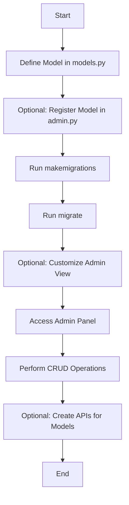

```mermaid
graph TD
    A[Start] --> B[Define Model in models.py]
    B --> C[Optional: Register Model in admin.py]
    C --> D[Run makemigrations]
    D --> E[Run migrate]
    E --> F[Optional: Customize Admin View]
    F --> G[Access Admin Panel]
    G --> H[Perform CRUD Operations]
    H --> I[Optional: Create APIs for Models]
    I --> J[End]

```
