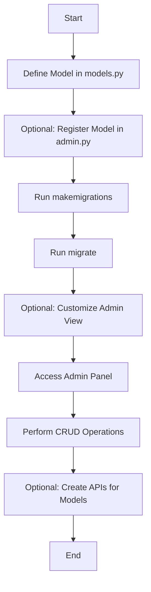

### 1. **Define the Model in `models.py`**

```python
from django.db import models

# Step 1: Define a Django model
class Book(models.Model):
    title = models.CharField(max_length=200)
    author = models.CharField(max_length=100)
    published_date = models.DateField()
    isbn = models.CharField(max_length=13)

    def __str__(self):
        return self.title
```

---

### 2. **Register the Model in `admin.py` (Optional)**

```python
from django.contrib import admin
from .models import Book

# Step 2: Register the model
admin.site.register(Book)

# Optional: Customize the admin view
class BookAdmin(admin.ModelAdmin):
    list_display = ('title', 'author', 'published_date')
    search_fields = ('title', 'author')

admin.site.register(Book, BookAdmin)
```

---

### 3. **Run Migrations**

Run the following commands in your terminal to apply the migrations.

#### **Generate Migration Files:**

```bash
python manage.py makemigrations
```

This will generate a migration file in your app’s `migrations/` folder, e.g., `0001_initial.py`.

#### **Apply Migrations:**

```bash
python manage.py migrate
```

This updates the database schema based on the defined model.

---

### 4. **Access the Admin Panel (Optional)**

1. Start the Django development server:
    
    ```bash
    python manage.py runserver
    ```
    
2. Go to `http://127.0.0.1:8000/admin/`.
3. Log in with your superuser credentials. If you don’t have a superuser yet, create one:
    
    ```bash
    python manage.py createsuperuser
    ```
    

You can now view and manage the `Book` model in the admin interface.

---

### 5. **Perform CRUD Operations**

Perform CRUD operations using the Django shell or within your views.

#### **Create a Record:**

```python
from myapp.models import Book  # Import the model

# Create a new book record
book = Book.objects.create(
    title="Django for Beginners",
    author="John Doe",
    published_date="2024-01-01",
    isbn="1234567890123"
)
print(book)
```

#### **Read Records:**

```python
# Fetch all books
books = Book.objects.all()
print(books)

# Fetch a specific book by ID
book = Book.objects.get(id=1)
print(book)
```

#### **Update a Record:**

```python
# Update a book's title
book.title = "Advanced Django"
book.save()
print(book.title)
```

#### **Delete a Record:**

```python
# Delete a book
book.delete()
```

---

### 6. **Create APIs for Models (Optional)**

Use Django REST Framework (DRF) to create APIs for the `Book` model.

#### **Install DRF:**

```bash
pip install djangorestframework
```

#### **Create a Serializer for the Model:**

In `serializers.py`:

```python
from rest_framework import serializers
from .models import Book

class BookSerializer(serializers.ModelSerializer):
    class Meta:
        model = Book
        fields = '__all__'
```

#### **Create a View for the API:**

In `views.py`:

```python
from rest_framework.viewsets import ModelViewSet
from .models import Book
from .serializers import BookSerializer

class BookViewSet(ModelViewSet):
    queryset = Book.objects.all()
    serializer_class = BookSerializer
```

#### **Add the API Route:**

In `urls.py`:

```python
from django.urls import path, include
from rest_framework.routers import DefaultRouter
from .views import BookViewSet

router = DefaultRouter()
router.register(r'books', BookViewSet)

urlpatterns = [
    path('', include(router.urls)),
]
```

Now, one can perform CRUD operations via API endpoints like `http://127.0.0.1:8000/books/`.
